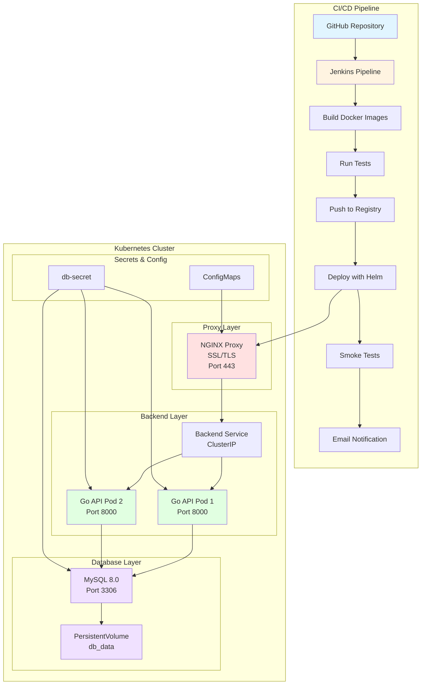

# Architecture Diagram

## ASCII Diagram

```
┌─────────────────────────────────────────────────────────────────────────────┐
│                          CI/CD PIPELINE (Jenkins)                            │
│                                                                               │
│  ┌──────────┐   ┌──────────┐   ┌──────────┐   ┌──────────┐   ┌──────────┐ │
│  │  Source  │──▶│  Build   │──▶│   Push   │──▶│  Deploy  │──▶│  Smoke   │ │
│  │ (GitHub) │   │ (Docker) │   │(Registry)│   │  (Helm)  │   │   Test   │ │
│  └──────────┘   └──────────┘   └──────────┘   └──────────┘   └──────────┘ │
│                                                                               │
└───────────────────────────────────────┬───────────────────────────────────────┘
                                        │
                                        ▼
┌─────────────────────────────────────────────────────────────────────────────┐
│                        KUBERNETES CLUSTER (Namespace: dev)                   │
│                                                                               │
│  ┌─────────────────────────────────────────────────────────────────────┐   │
│  │                         INGRESS / LOAD BALANCER                      │   │
│  │                              (HTTPS - Port 443)                      │   │
│  └────────────────────────────────┬─────────────────────────────────────┘   │
│                                   │                                          │
│  ┌────────────────────────────────▼─────────────────────────────────────┐   │
│  │                          PROXY LAYER (NGINX)                         │   │
│  │  ┌──────────────────────────────────────────────────────────────┐   │   │
│  │  │  • SSL/TLS Termination                                       │   │   │
│  │  │  • Reverse Proxy                                             │   │   │
│  │  │  • Load Balancing                                            │   │   │
│  │  │  • Image: nginx_proxy                                        │   │   │
│  │  │  • Service: NodePort (30443)                                 │   │   │
│  │  └──────────────────────────────────────────────────────────────┘   │   │
│  └────────────────────────────────┬─────────────────────────────────────┘   │
│                                   │ HTTP                                     │
│  ┌────────────────────────────────▼─────────────────────────────────────┐   │
│  │                       BACKEND LAYER (Go API)                         │   │
│  │  ┌──────────────────────────────────────────────────────────────┐   │   │
│  │  │  • REST API (Gorilla Mux)                                    │   │   │
│  │  │  • Port: 8000                                                │   │   │
│  │  │  • Replicas: 2 (High Availability)                           │   │   │
│  │  │  • Image: backend (Multi-stage build)                        │   │   │
│  │  │  • Service: ClusterIP                                        │   │   │
│  │  │  • Health Checks: Liveness & Readiness                       │   │   │
│  │  └──────────────────────────────────────────────────────────────┘   │   │
│  └────────────────────────────────┬─────────────────────────────────────┘   │
│                                   │ MySQL Protocol                           │
│  ┌────────────────────────────────▼─────────────────────────────────────┐   │
│  │                      DATABASE LAYER (MySQL 8.0)                      │   │
│  │  ┌──────────────────────────────────────────────────────────────┐   │   │
│  │  │  • Database: example                                         │   │   │
│  │  │  • Port: 3306                                                │   │   │
│  │  │  • Image: mysql:8.0                                          │   │   │
│  │  │  • Service: ClusterIP                                        │   │   │
│  │  │  • Storage: PersistentVolume (db_data)                       │   │   │
│  │  └──────────────────────────────────────────────────────────────┘   │   │
│  └──────────────────────────────────────────────────────────────────────┘   │
│                                                                               │
│  ┌─────────────────────────────────────────────────────────────────────┐   │
│  │                         KUBERNETES RESOURCES                         │   │
│  │                                                                       │   │
│  │  • Secrets: db-secret (Database credentials)                         │   │
│  │  • ConfigMaps: nginx.conf                                            │   │
│  │  • PersistentVolume: db-data-pv (10Gi)                               │   │
│  │  • PersistentVolumeClaim: db-data-pvc                                │   │
│  │  • ServiceAccount: jenkins-sa                                        │   │
│  │  • RBAC: ClusterRole, RoleBinding                                    │   │
│  └─────────────────────────────────────────────────────────────────────┘   │
│                                                                               │
└─────────────────────────────────────────────────────────────────────────────┘

┌─────────────────────────────────────────────────────────────────────────────┐
│                          LOCAL DEVELOPMENT (Docker Compose)                  │
│                                                                               │
│  ┌──────────────┐         ┌──────────────┐         ┌──────────────┐        │
│  │    PROXY     │────────▶│   BACKEND    │────────▶│   DATABASE   │        │
│  │   (NGINX)    │  HTTP   │     (Go)     │  MySQL  │   (MySQL)    │        │
│  │  Port: 443   │         │  Port: 8000  │         │  Port: 3306  │        │
│  └──────────────┘         └──────────────┘         └──────────────┘        │
│         │                                                   │                │
│         │                                                   │                │
│    ┌────▼─────┐                                      ┌─────▼──────┐        │
│    │   SSL    │                                      │  db_data   │        │
│    │  Certs   │                                      │  (Volume)  │        │
│    └──────────┘                                      └────────────┘        │
│                                                                               │
│  Secrets: db-password.txt (mounted as Docker secret)                        │
│                                                                               │
└─────────────────────────────────────────────────────────────────────────────┘
```

## Detailed Component Diagram

```
┌─────────────────────────────────────────────────────────────────────────────┐
│                              DOCKER BUILD PROCESS                            │
│                                                                               │
│  Backend Multi-Stage Build:                                                  │
│  ┌─────────────────┐      ┌─────────────────┐      ┌─────────────────┐    │
│  │   Stage 1:      │      │   Stage 2:      │      │   Stage 3:      │    │
│  │   Build         │─────▶│   Test          │─────▶│   Release       │    │
│  │                 │      │                 │      │                 │    │
│  │ • golang:1.19   │      │ • Run tests     │      │ • alpine        │    │
│  │ • go mod        │      │ • go test       │      │ • Copy binary   │    │
│  │ • go build      │      │                 │      │ • Minimal size  │    │
│  └─────────────────┘      └─────────────────┘      └─────────────────┘    │
│                                                                               │
│  Proxy Build:                                                                │
│  ┌─────────────────┐                                                        │
│  │ • nginx:alpine  │                                                        │
│  │ • nginx.conf    │                                                        │
│  │ • SSL certs     │                                                        │
│  └─────────────────┘                                                        │
└─────────────────────────────────────────────────────────────────────────────┘

┌─────────────────────────────────────────────────────────────────────────────┐
│                              DATA FLOW                                       │
│                                                                               │
│  1. Client Request (HTTPS)                                                   │
│     │                                                                         │
│     ▼                                                                         │
│  2. NGINX Proxy (SSL Termination)                                           │
│     │                                                                         │
│     ▼                                                                         │
│  3. Backend API (Process Request)                                           │
│     │                                                                         │
│     ▼                                                                         │
│  4. MySQL Database (Query Data)                                             │
│     │                                                                         │
│     ▼                                                                         │
│  5. Response (JSON) ← ← ← ← ← ← ← ← ← ← ← ← ← ← ← ← ← ← ← ← ← ← ← ← ← ← │
│                                                                               │
└─────────────────────────────────────────────────────────────────────────────┘

┌─────────────────────────────────────────────────────────────────────────────┐
│                          NETWORK ARCHITECTURE                                │
│                                                                               │
│  External Network (Internet)                                                 │
│         │                                                                     │
│         ▼                                                                     │
│  ┌─────────────┐                                                            │
│  │   Port 443  │ (HTTPS)                                                    │
│  └──────┬──────┘                                                            │
│         │                                                                     │
│         ▼                                                                     │
│  ┌─────────────────────────────────────────────────────────────┐           │
│  │              Proxy Network (proxy-backend)                   │           │
│  │  ┌──────────┐                    ┌──────────┐               │           │
│  │  │  Proxy   │───────────────────▶│ Backend  │               │           │
│  │  └──────────┘                    └──────────┘               │           │
│  └─────────────────────────────────────────────────────────────┘           │
│                                           │                                  │
│                                           ▼                                  │
│  ┌─────────────────────────────────────────────────────────────┐           │
│  │            Backend Network (backend-database)                │           │
│  │  ┌──────────┐                    ┌──────────┐               │           │
│  │  │ Backend  │───────────────────▶│ Database │               │           │
│  │  └──────────┘                    └──────────┘               │           │
│  └─────────────────────────────────────────────────────────────┘           │
│                                                                               │
│  Note: Each tier is isolated in separate networks for security              │
│                                                                               │
└─────────────────────────────────────────────────────────────────────────────┘
```

## Mermaid Diagram (for GitHub/Documentation)



## Technology Stack Diagram

```
┌─────────────────────────────────────────────────────────────────┐
│                      TECHNOLOGY STACK                            │
├─────────────────────────────────────────────────────────────────┤
│                                                                   │
│  Application Layer:                                              │
│  ┌──────────────────────────────────────────────────────────┐  │
│  │  Go 1.19 | Gorilla Mux | MySQL Driver                    │  │
│  └──────────────────────────────────────────────────────────┘  │
│                                                                   │
│  Containerization:                                               │
│  ┌──────────────────────────────────────────────────────────┐  │
│  │  Docker | Docker Compose | Multi-stage Builds            │  │
│  └──────────────────────────────────────────────────────────┘  │
│                                                                   │
│  Orchestration:                                                  │
│  ┌──────────────────────────────────────────────────────────┐  │
│  │  Kubernetes | Helm 3 | kubectl                           │  │
│  └──────────────────────────────────────────────────────────┘  │
│                                                                   │
│  CI/CD:                                                          │
│  ┌──────────────────────────────────────────────────────────┐  │
│  │  Jenkins | Groovy Pipeline | Docker-in-Docker            │  │
│  └──────────────────────────────────────────────────────────┘  │
│                                                                   │
│  Infrastructure:                                                 │
│  ┌──────────────────────────────────────────────────────────┐  │
│  │  NGINX | MySQL 8.0 | Alpine Linux                        │  │
│  └──────────────────────────────────────────────────────────┘  │
│                                                                   │
│  Security:                                                       │
│  ┌──────────────────────────────────────────────────────────┐  │
│  │  SSL/TLS | Kubernetes Secrets | RBAC | Docker Secrets    │  │
│  └──────────────────────────────────────────────────────────┘  │
│                                                                   │
└─────────────────────────────────────────────────────────────────┘
```

## Deployment Flow Diagram

```
Developer Workflow:
═══════════════════

┌──────────┐
│Developer │
│  Commit  │
└────┬─────┘
     │
     ▼
┌─────────────┐
│   GitHub    │
│ Repository  │
└────┬────────┘
     │ (Webhook)
     ▼
┌─────────────────────────────────────────────────────────┐
│              Jenkins Pipeline Stages                     │
├─────────────────────────────────────────────────────────┤
│                                                           │
│  1. Source      → Clone repository                       │
│  2. Build       → docker build (backend, proxy)          │
│  3. Test        → Run unit tests                         │
│  4. Push        → docker push to registry                │
│  5. Deploy      → helm upgrade --install                 │
│  6. Verify      → curl health check                      │
│  7. Notify      → Email success/failure                  │
│                                                           │
└────────────────────────┬────────────────────────────────┘
                         │
                         ▼
┌─────────────────────────────────────────────────────────┐
│              Kubernetes Cluster                          │
├─────────────────────────────────────────────────────────┤
│                                                           │
│  • Helm creates/updates resources                        │
│  • Pods are scheduled                                    │
│  • Services are exposed                                  │
│  • Health checks pass                                    │
│  • Application is live                                   │
│                                                           │
└─────────────────────────────────────────────────────────┘
```

---

## How to Use These Diagrams

1. **ASCII Diagrams**: Copy directly into documentation or terminal
2. **Mermaid Diagram**: Paste into GitHub README.md or any Mermaid-compatible viewer
3. **For Presentations**: Convert to visual diagrams using tools like:
   - draw.io (diagrams.net)
   - Lucidchart
   - Microsoft Visio
   - Excalidraw

## Diagram Files for Visual Tools

You can also create these diagrams in:
- **PlantUML** for automated diagram generation
- **Kubernetes Dashboard** for live cluster visualization
- **Grafana** for monitoring dashboards
